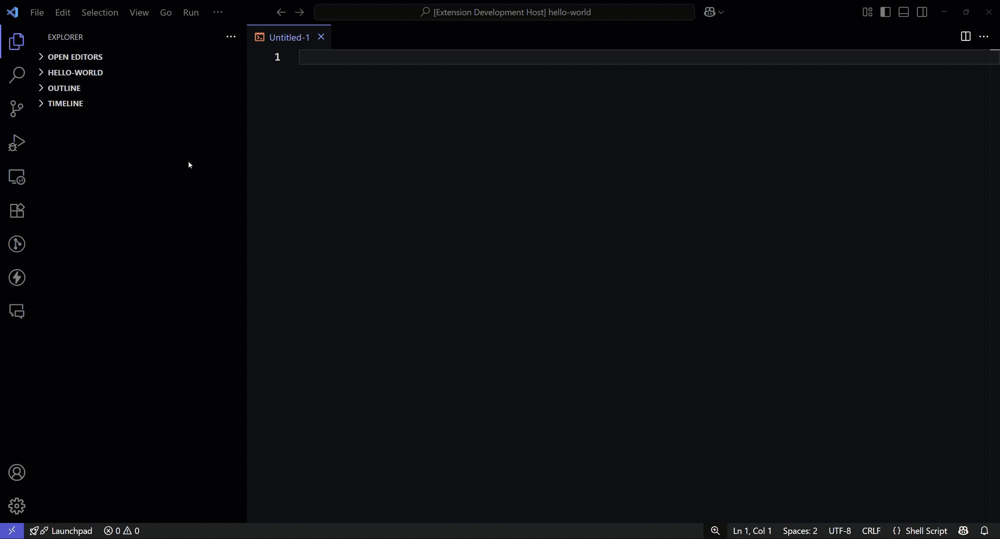

# ONTAP Ansible Snippets

**ONTAP Ansible Snippets** is a Visual Studio Code extension that allows you to quickly search and insert NetApp ONTAP Ansible snippets directly into your editor.  
This extension helps you automate NetApp ONTAP management tasks by providing ready-to-use, trusted Ansible playbook examples.

## Features

- Search for Ansible snippets by keyword or description.  
- Insert ONTAP Ansible tasks into your playbooks with a single click.  
- Supports multiple NetApp Ansible collection versions (23.1.0, 23.0.0).  
- Snippets cover common storage operations: volume provisioning, snapshot management, replication, SVM configuration, and more.

## Installation

1. Open **Visual Studio Code**.  
2. Go to the **Extensions** view (`Ctrl+Shift+X`).  
3. Search for `ONTAP Ansible Snippets`.  
4. Click **Install**.  

## Usage

1. Open a YAML or Ansible playbook file in VS Code.  
2. Open the Command Palette (`Ctrl+Shift+P` or `Cmd+Shift+P` on Mac).  
3. Type and select:
   - `ONTAP Ansible Snippets - v23.1.0`  
   - or `ONTAP Ansible Snippets - v23.0.0`
4. Search for a snippet by keyword or description.  
5. Select a snippet to insert it at your cursor location.  

## References

- https://galaxy.ansible.com/ui/repo/published/netapp/ontap
- https://github.com/ansible-collections/netapp.ontap

## License

MIT License  

## Author

Developed and maintained by [Rajesh V U](https://www.rajeshvu.com)